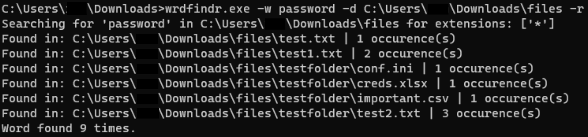

# wrdfindr

## Purpose

`wrdfindr` was built to aid in security audits and authorized offensive security activities by providing a fast and portable way to find insecure configurations or sensitive data on disk.\

When performing troubleshooting or conducting an audit, I would often ask questions like:\

- Are there any files that are storing credentials/secrets in cleartext?
- Are insecure services (ex: telnet) referenced in configuration files?
- How can I hunt down X string that continually shows up in logs?

The goal of this tool is to help answer those questions.\

NOTE: The purpose of this tool is to simply conduct a quick query of information, it is by no means an all intensive or fully featured search engine.\


---

## Example Usage


```powershell
wrdfindr.exe -w telnet -d C:\Data -o results.csv
```

---

## Features

- Recursive directory scanning
- Optional case-sensitive searching
- Supports common text-based formats and PDFs
- Optional CSV output
- Offline execution (no network calls)
- Available as a Windows executable


## Prerequisites

### Running from source

Python 3.10 or newer\
Dependencies listed in `requirements.txt`

### Running as an executable

Windows operating system\
No Python runtime required\

---

## Installation

### Option 1: Windows executable

Download the executable from the repository and run it directly.

### Option 2: Run from source

```bash
pip install -r requirements.txt
python WordFinder.py --help
```

---

### Common Options

- `-d`, `--directory` – Directory to scan
- `-w`, `--word` – Keyword to search for (case-insensitive)
- `-o`, `--output` – Output CSV file

Run `--help` for the full list of options.

---

## Output

When CSV output is enabled, results include:

- File path
- File extension
- Match count per file

---

## Limitations

- Not a full text indexing or search engine
- Limited binary format support (PDFs only)
- No real-time or live file monitoring

---

## Potential Future Improvements

- Support for multiple keywords in one query
- Regex-based support
- Progress indicators for large directory scans
